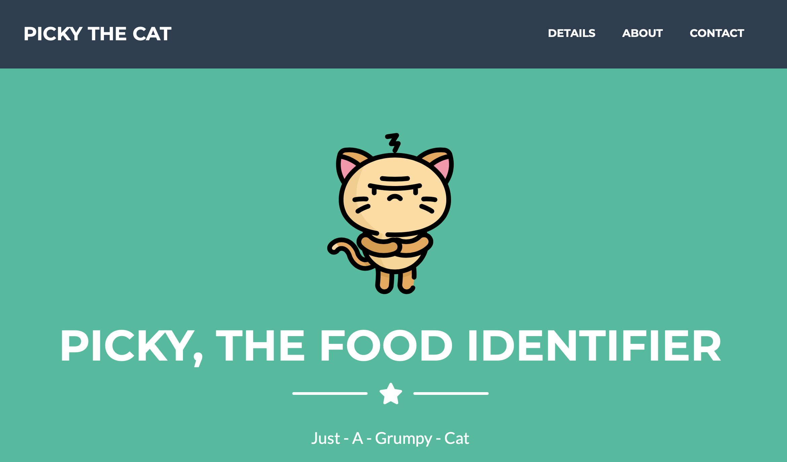
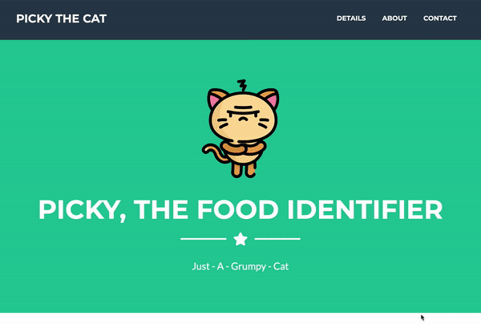
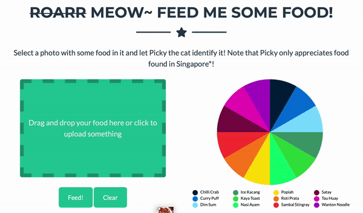
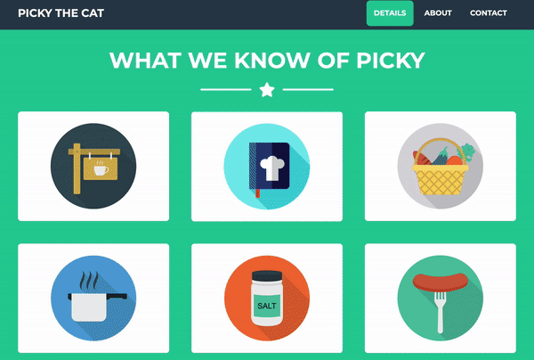
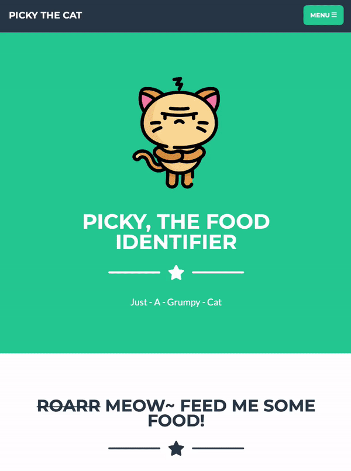
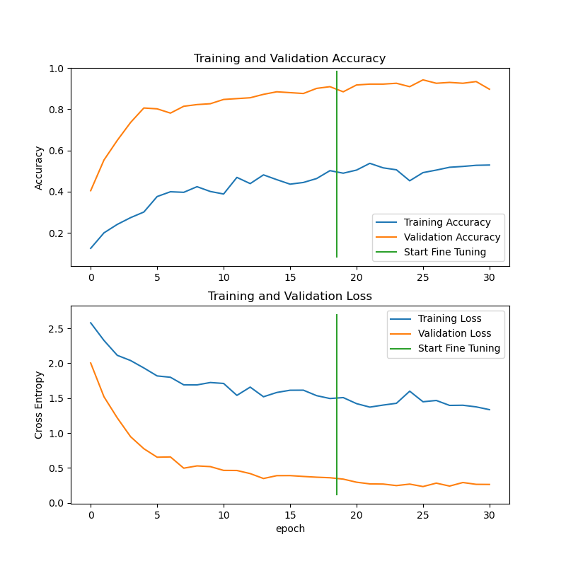

# Week 7: Picky, The Food Identifier



A simple application for automatic identification of (certain) food types in images.
  
## Table of Contents

- [Overview](#overview)
- [Getting Started](#getting-started)
- [Web Interface](#web-interface)
- [API Endpoint Usage](#api-endpoint-usage)
- [Application Architecture](#application-architecture)
- [Machine Learning Model Architecture](#machine-learning-model-architecture)
- [Training & Testing Procedures](#training--testing-procedures)
    - [Initial Training](#initial-training)
    - [Fine Tuning](#fine-tuning)
    - [Model Evaluation](#model-evaluation)
- [The Most Out of Place Section: Continuous Improvement/ Continuous Delivery](#the-most-out-of-place-section-continuous-improvement-continuous-delivery)
- [Acknowledgements](#acknowledgements)
- [Contact](#contact)

## Overview
This web application essentially aims to identify the type of food displayed in an image, out of a total of 12 different
  food classes, all of which are drawn from common everyday food found in Singapore. 
  
 *Serious tone switches off from this point onwards - Why so serious? :D*

What use can there be for this? Well I suppose, if there is for some unknown reason that'd make you want to tag random
 food images that you have of food that you can find in Singapore, especially those on the web, this can perhaps... be
  useful
 . 
 
 On a much smaller scale, if you have a friend who has just arrived in Singapore or the surrounding region and can't 
 identify local food for whatsoever reason, then maybe he/she would like to use this - imagine a person taking photos
  of food he/she sees to identify them I guess? Maybe that person needs to know if something is spicy in advance
   before eating it?
   
Okay enough of the nonsensical fluff for now and let's move on...
  
## Getting Started
All the relevant packages that you'll need are listed in the `conda.yml` file found in the main project directory so
 install all of those somewhere, preferably in a conda environment, before running the application locally.
 
 For those who can't google or use too much virtualenv (like yours truly) to know this:
 ```.env
 conda env create -f conda.yml
```

 To run the web app locally, simply run this (note that you might need to uncomment/comment certain lines if the code
  was last left in a state for deployment):
 ```.env
python src.app
```

The app should run on the local port 8000. You can then send HTTP requests to your local server (always alone) either
 by using ways such as, but not limited to, of course,
 1) the browser graphical user interface
 2) the curl command line tool 
 3) the Requests package for Python
 4) essentially anything else that can send HTTP requests (too many for me to list)
 
## Web Interface



The web interface has been designed to allow for easy uploading and predicting of image classes. Simply click on the
 upload area or drag an image to it to select a photo. Select on 'Feed!' to submit the image. The predicted class
  name with appear on the preview image.
  
  
  
  A pie chart would also automatically be generated to visualise the prediction probabilities of the different classes. 
  Hover over any of the pie chart slices to get more information about the prediction probabilities and classes.
 
 
 
 Some brief documentation of the features of this model has also been included in the web interface. Click on them to
  find out more (if you are too lazy to read this page).
 
 Note that the visual interface has been somewhat optimised even for mobile devices with smaller screens so feel free
  to use it on the go (if you ever have the need to).
  
<p float="left">
  
  
</p>

^ Whoops hope you didn't get seizures from all those flashy GIFs 😅
  
## API Endpoint Usage
There are four (for now - don't judge) API endpoints implemented for this project:

- `index`

The most boring and useless endpoint of them all. Accepts any HTTP request and basically returns a HTML document
 containing information about the model and training. **Yet to be really implemented because well, there are better 
 things to judge its book than by its cover right?**
  
- `short_description`

Slightly less useless than the previous one, but it essentially returns information about the model and what input it
 expects in JSON format. Accepts only a `GET` HTTP method specified in a request.
 
- `predict`

Ah the sole key aspect of this entire project (even though it's ultimately not super impressive) - returns the
 predicted food type and a prediction value from 0 to 1 indicating the probability that the prediction is true, upon
  receiving an absolute image path that leads to the image that contains the food to be identified. Accepts only a
   `POST` HTTP request that contains the image path specified as an upload directory.
   
- `gui_predict`

Only used for the web browser interface to return a dictionary containing key-value pairs of the class predictions of
 the different types of food, and their corresponding prediction probabilities. Note that the names of the food
  classes returned are capitalised and have their underscores removed as they would be used to display the class
   names on the web application. Accepts only a `POST` HTTP request that contains the image data that has been
    jsonified and converted to its base64 radix representation.
   
## Application Architecture
The frontend of this project is basically handled with the usual frontend development triad, HTML, CSS, and
 JavaScript. In particular, the library D3.js was used to create the visualisation of the prediction probabilities of
  an image uploaded to the server.
 
 Besides interacting directly with the web browser interface, users can also use other ways (refer to [Usage](#usage)) 
 to make HTTP requests to the app server, which are then handled by a Flask backend, which if necessary, then uses a
  pretrained classification model built with TensorFlow/Keras to generate predictions for the image specified.
   
## Machine Learning Model Architecture
For those who like delving into the more nitty-gritty details, the classification model that has been built for this
 web application is in fact a convolutional neural net (CNN) that is itself built upon another CNN, a ResNet50V2 base
  model trained on ImageNet images, followed by 3 fully connected hidden layers of size 256, 128 and 64 respectively. 
  Each of these 3 additional hidden layers also feature a dropout of 0.2 and a relu activation function. The final
   output layer simply consists of a fully connected layer with 12 outputs, each producing a score for a given class.
   
In essence, the model can be summarised as having these layers:
- ResNet50V2 (input shape 224x224x3)
- Hidden layer 1 + relu activation (256 nodes)
- Dropout 1 (0.2)
- Hidden layer 2 + relu activation (128 nodes)
- Dropout 2 (0.2)
- Hidden layer 3 + relu activation (64 nodes)
- Dropout 3 (0.2)
- Output layer (12 nodes)

## Training & Testing Procedures

Training and testing of the machine learning model in this application in 3 main steps:

### Initial Training
The model above was initially trained with all the layers of the original ResNet50V2 frozen on a set of 733 images
 belonging to the 12 different food classes, with early stopping being done when the validation loss (done on a 
 separate validation set of 242 images) shows no improvement for 5 consecutive epochs. 

This occurred after training for 19 epochs with a batch size of 64 and a base learning rate of 0.0025 with an Adam
 optimiser.
  
  The chart below shows the training and validation metrics of the model at this stage.
  
  
  
### Fine Tuning

For this stage, the model weights obtained from the previous stage were kept, though training was now unfrozen for
 the ResNet50V2 base model after the initial 100 layers. The same early stopping mechanism was employed for this
  stage and the model is similarly trained with the same training images and validation images.
  
  Early stopping occurred after training for an additional 12 epochs with a batch size of 64 and a much smaller base
   learning rate of 0.000025 with an Adam optimiser.

The chart below shows the training and validation metrics of the model for both the initial training stage, and for
 the fine tuning stage. The green line highlights the separation between the two stages.
 
 

### Model Evaluation
To evaluate the performance of the model, a test set of 249 hereby unseen images (unused for both the test and
 validation sets
 mentioned before) was used. This final model demonstrated an accuracy of 0.8956.
 
 More precise information on the test metrics are shown below:
 
 ```.env
                  precision    recall  f1-score   support
 
     chilli_crab       0.93      0.67      0.78        21
      curry_puff       0.91      0.95      0.93        21
         dim_sum       1.00      1.00      1.00        35
      ice_kacang       0.95      1.00      0.97        18
      kaya_toast       1.00      0.85      0.92        20
       nasi_ayam       0.64      0.82      0.72        17
          popiah       0.89      0.81      0.85        21
      roti_prata       0.95      0.95      0.95        21
 sambal_stingray       0.84      1.00      0.91        21
           satay       0.86      0.90      0.88        21
        tau_huay       0.87      1.00      0.93        13
   wanton_noodle       0.88      0.75      0.81        20
 
        accuracy                           0.90       249
       macro avg       0.89      0.89      0.89       249
    weighted avg       0.90      0.90      0.89       249
```

## Acknowledgements

Gotta give all the credit where it's due when I've gotten inspired/adapted their work and ideas for this:

- Start Bootstrap for their Freelancer theme (HTML/CSS/JavaScript frontend template)
- mtobeiyf on GitHub for his/her/their image uploading and previewing widget
- JR Schmidt on Medium for her guides on animated donut/pie charts using D3.js
- Freepik on flaticon for his/her/their well-designed and adorable icons as well as for Picky's icon
- And all the other contributors who have directly or indirectly contributed to the projects and work of the people
 listed above (they should've also already been credited too)
 
## Contact
Get in touch with me at my Linkedin account at <https://sg.linkedin.com/in/zi-yi-ewe>.

Ewe Zi Yi.
